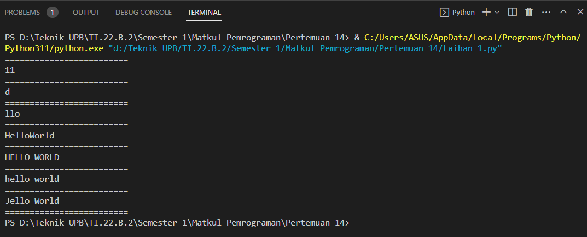
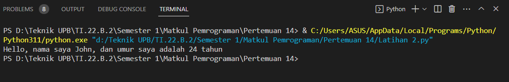

# Pratikum10

> Operasi String

# Soal Latihan 1

    txt = 'Hello World'

    * Hitung jumlah karakternya
    * Ambil karakter terakhir
    * Ambil karakter index ke-2 sampai index ke-4 (llo)
    * Hilangkan spasi pada text tersebut (HelloWorld)
    * Ubah text menjadi huruf besar
    * Ubah text menjadi huruf kecil
    * Ganti karakter H dengan karakter J

> Kode Program

txt = 'Hello World'
print("=========================")
print(len(txt))

print("=========================")

txt = 'Hello World'
print(txt[-1])

print("=========================")

txt = 'Hello World'
print(txt[2:5])

print("=========================")

txt = 'Hello World'
print(txt.replace(" ", ""))

print("=========================")

txt = 'Hello World'
print(txt.upper())

print("=========================")

txt = 'Hello World'
print(txt.lower())

print("=========================")

txt = 'Hello World'
print(txt.replace("H", "J"))

print("=========================")

> Tampilan Program

# Latihan 2 

* Lengkapi Kode Latihan 2

    umur = 24 txt = 'Hello, nama saya john, dan umur saya adalah ... tahun'
    print(txt.format(umur))

* Kode Program 

    > umur = 24
    txt = 'Hello, nama saya John, dan umur saya adalah {} tahun'
    print(txt.format(umur))
* Tampilan Program

    

    

===============SEKIAN TERIMAKASIH===========

